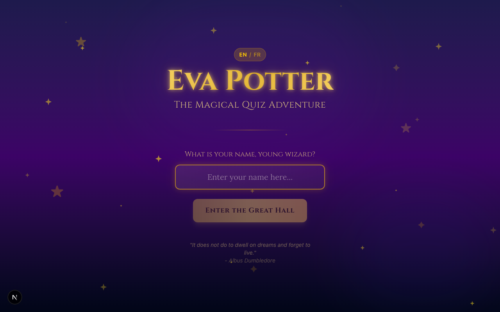
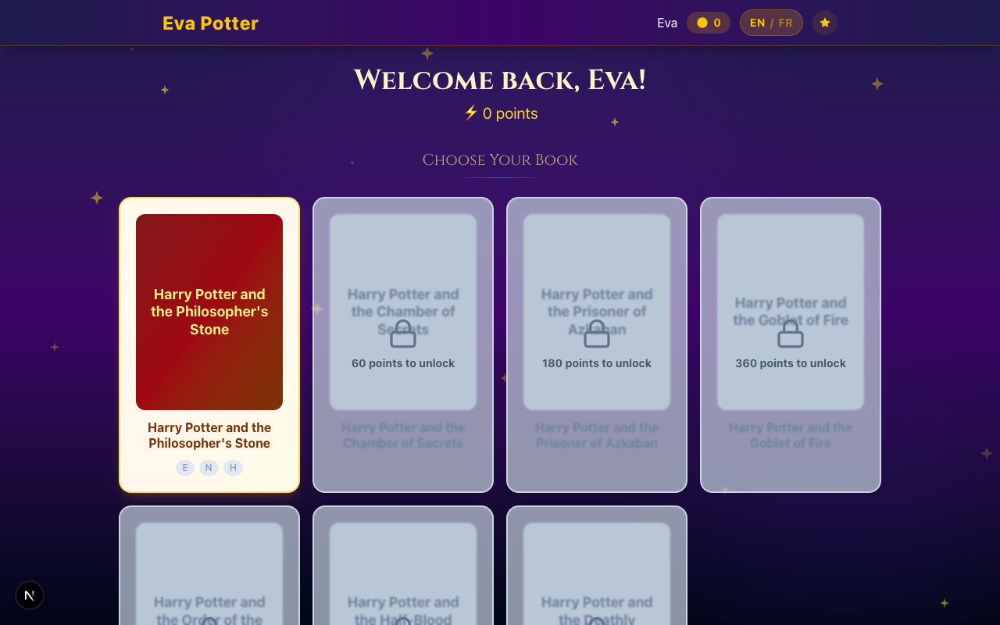
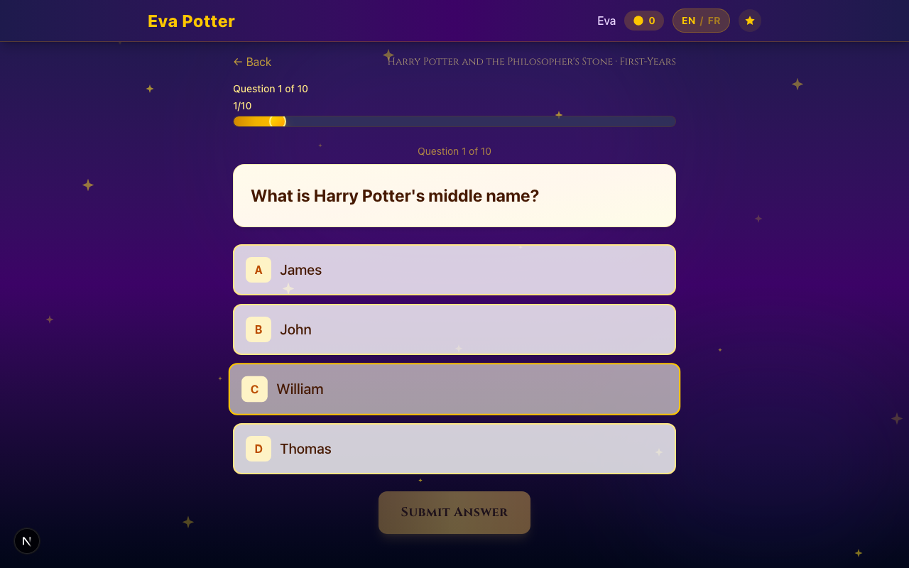
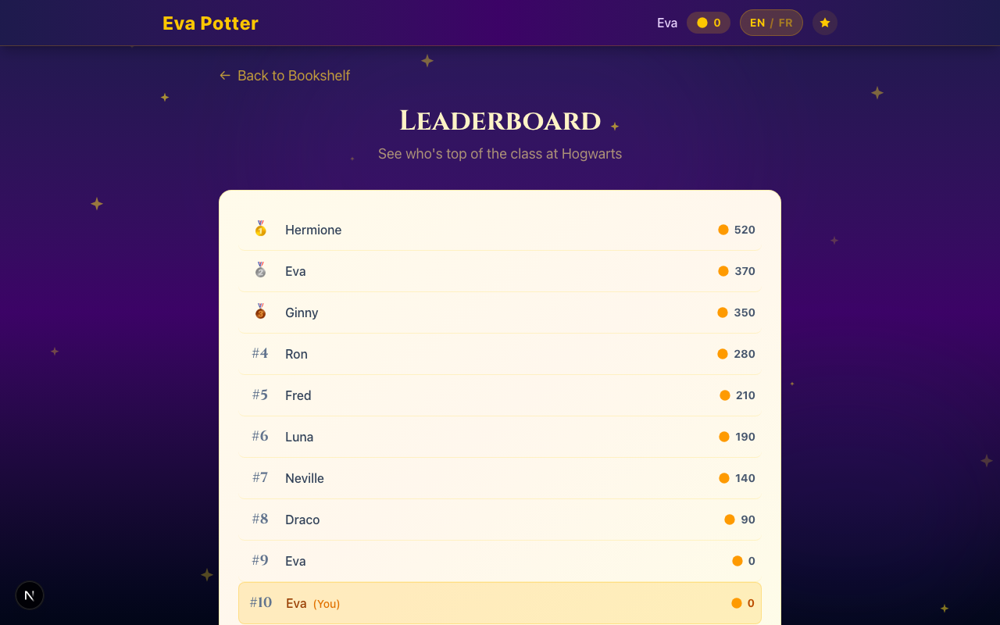

# Eva Potter

A magical Harry Potter quiz app built for kids. Test your knowledge across all 7 books, earn points, unlock new adventures, and climb the leaderboard.



## Features

- **All 7 Books** — Questions spanning the entire Harry Potter series
- **3 Difficulty Levels** — First-Years (easy), O.W.L.s (normal), and N.E.W.T.s (hard)
- **270 Questions** — 10 per book per difficulty, with explanations
- **Bilingual** — Full English and French support (questions, UI, book descriptions)
- **Progressive Unlocking** — Earn points to unlock the next book
- **Points System** — 10 / 20 / 30 points per correct answer by difficulty
- **Leaderboard** — Compare scores with other players
- **Progress Tracking** — See your stats and journey on the Hogwarts Express

| Bookshelf | Quiz | Leaderboard |
|:-:|:-:|:-:|
|  |  |  |

## Tech Stack

- [Next.js 16](https://nextjs.org/) with App Router
- [React 19](https://react.dev/)
- [SQLite](https://www.sqlite.org/) via better-sqlite3 + [Drizzle ORM](https://orm.drizzle.team/)
- [Tailwind CSS 4](https://tailwindcss.com/)
- [Framer Motion](https://motion.dev/)
- TypeScript

## Getting Started

```bash
# Install dependencies
npm install

# Set up the database (migrate + seed 270 questions)
npm run db:setup

# Start the dev server
npm run dev
```

Open [http://localhost:3000](http://localhost:3000).

### Other Commands

```bash
npm run db:generate   # Generate Drizzle migrations
npm run db:migrate    # Run migrations only
npm run db:seed       # Seed only
npm run db:studio     # Open Drizzle Studio
npm run test          # Run tests
npm run test:watch    # Run tests in watch mode
npm run build         # Production build
npm run start         # Start production server
```

## Docker

### Development

```bash
docker compose up
```

Live-reloads with your local source mounted.

### Production

```bash
# Standalone
docker compose -f docker-compose.production.yml up -d

# Or alongside other services (e.g. Taktikal)
docker compose -f docker-compose.prod.yml up -d
```

The production image uses a multi-stage build and ships with a pre-seeded database.

## Project Structure

```
src/
├── app/                  # Next.js routes
│   ├── api/              # REST API (user, books, quiz, leaderboard)
│   ├── books/            # Book selection → difficulty → quiz → results
│   ├── leaderboard/      # Leaderboard page
│   └── progress/         # Progress tracking page
├── components/
│   ├── bookshelf/        # Book display
│   ├── layout/           # Header, background
│   ├── providers/        # User and Language context
│   ├── quiz/             # Quiz flow components
│   ├── results/          # Score and review
│   └── ui/               # Shared UI components
├── db/
│   ├── schema.ts         # Drizzle schema (users, books, questions, progress, answers)
│   ├── seed.ts           # 270 questions across 7 books × 3 difficulties
│   └── index.ts          # Database client
└── lib/
    └── i18n/             # EN/FR translations and French question data
```
