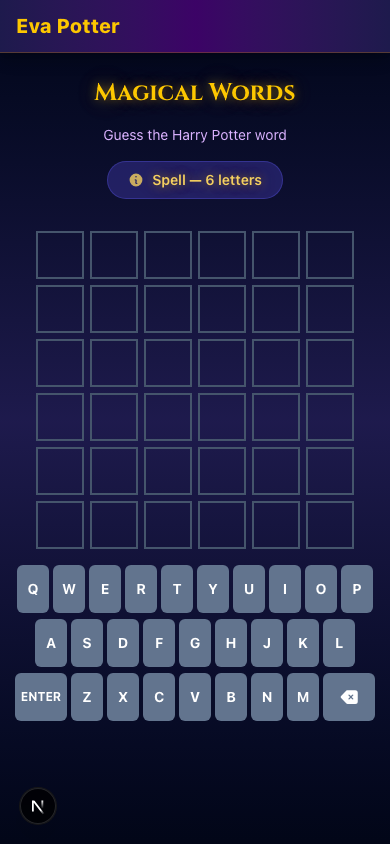

# Eva Potter

A magical Harry Potter app built for kids. Test your knowledge across all 7 books, play mini-games, get sorted into your Hogwarts house, reveal your Patronus, earn achievements, and climb the leaderboard.


## Features

### Core
- **All 7 Books** — Questions spanning the entire Harry Potter series
- **4 Difficulty Levels** — First-Years (easy), O.W.L.s (normal), N.E.W.T.s (hard), and Order of the Phoenix (expert)
- **280 Questions** — 10 per book per difficulty, with explanations
- **Bilingual** — Full English and French support (questions, UI, everything)
- **Name + PIN Login** — Kids pick a 4-digit PIN to save and resume progress across sessions
- **Progressive Unlocking** — Earn points to unlock the next book

### Mini-Games
- **Magical Words (Wordle)** — Guess HP words (characters, spells, creatures, places, objects, potions) in up to 6 attempts with color feedback. 120 curated words, variable length (4-8 letters)
- **Potions Class** — 4x4 memory card matching game with magical ingredients. Points scale by speed: <30s = 80pts, <60s = 60pts, <90s = 40pts, <120s = 20pts, else 10pts
- **Spell Duel** — 5 rounds of spell identification with a 5-second timer per round. Points scale by reaction time: <1s = 30pts, <2s = 25pts, <3s = 20pts, <5s = 15pts. Max 150pts per duel
- **Daily Challenge** — One quiz question + one wordle word per day with 2x point bonus. Changes every day, can only be completed once
- **Goblet of Fortune** — Rare (~5%) luck-based mini-game between questions: bet points, pick a flame, win 3x or lose your bet

### Progression
- **House Sorting Ceremony** — 4 personality questions with a dramatic reveal animation. Determines your Hogwarts house (Gryffindor, Slytherin, Ravenclaw, or Hufflepuff)
- **Patronus Reveal** — Unlock at 500+ points. Full-screen silvery mist animation reveals one of 20 magical animals
- **19 Achievements** — Unlock badges for milestones like first quiz, point thresholds, wordle streaks, perfect duels, fast potion brewing, and more
- **Leaderboard** — Players tab + Houses tab showing house standings with total points and member counts
- **Progress Tracking** — See your stats and journey on the Hogwarts Express
- **Points System** — Quiz: 10/20/30/40 by difficulty; Wordle: 60→10 by guesses; Potions/Duel: speed-based
- **Admin Reset** — Hidden admin page to wipe all user data for a fresh start (e.g. new school year)

| Bookshelf | Quiz | Wordle | Leaderboard |
|:-:|:-:|:-:|:-:|
|  |  |  |  |

## Tech Stack

- [Next.js 16](https://nextjs.org/) with App Router
- [React 19](https://react.dev/)
- [SQLite](https://www.sqlite.org/) via better-sqlite3 + [Drizzle ORM](https://orm.drizzle.team/)
- [Tailwind CSS 4](https://tailwindcss.com/)
- [Framer Motion](https://motion.dev/)
- TypeScript

## Getting Started

```bash
# Install dependencies
npm install

# Set up the database (migrate + seed 280 questions)
npm run db:setup

# Start the dev server
npm run dev
```

Open [http://localhost:3000](http://localhost:3000).

### Other Commands

```bash
npm run db:generate   # Generate Drizzle migrations
npm run db:migrate    # Run migrations only
npm run db:seed       # Seed only
npm run db:studio     # Open Drizzle Studio
npm run test          # Run tests
npm run test:watch    # Run tests in watch mode
npm run build         # Production build
npm run start         # Start production server
```

## Docker

### Development

```bash
docker compose up
```

Live-reloads with your local source mounted.

### Production

```bash
# Standalone
docker compose -f docker-compose.production.yml up -d

# Or alongside other services (e.g. Taktikal)
docker compose -f docker-compose.prod.yml up -d
```

The production image uses a multi-stage build and ships with a pre-seeded database.

## Admin Reset

Navigate to `/admin/reset` to wipe all user data (users, progress, answers, wordle results, achievements, daily completions, potions results, duel results). Books, questions, and game settings are kept intact.

- **Password**: Set via `ADMIN_PASSWORD` env var (default: `hogwarts`)
- **No link in the UI** — admin navigates directly by URL
- Useful for starting fresh with a new class of students each school year

## Project Structure

```
src/
├── app/                  # Next.js routes
│   ├── admin/reset/      # Admin reset page
│   ├── api/              # REST API (user, books, quiz, wordle, leaderboard, sorting, achievements, daily, potions, duel, patronus, admin)
│   ├── achievements/     # Trophy case page
│   ├── books/            # Book selection → difficulty → quiz → results
│   ├── daily/            # Daily challenge page (quiz + wordle)
│   ├── duel/             # Spell duel game page
│   ├── leaderboard/      # Leaderboard page (players + houses tabs)
│   ├── potions/          # Potions memory card game page
│   ├── progress/         # Progress tracking + Patronus reveal
│   ├── sorting/          # House sorting ceremony
│   └── wordle/           # Wordle game page
├── components/
│   ├── achievements/     # Achievement unlock popup
│   ├── bookshelf/        # Book display
│   ├── duel/             # Duel round component with countdown
│   ├── layout/           # Header (responsive with hamburger menu)
│   ├── patronus/         # Patronus reveal animation
│   ├── potions/          # Potion card with flip animation
│   ├── providers/        # User and Language context
│   ├── quiz/             # Quiz flow components
│   ├── results/          # Score and review
│   ├── wordle/           # Wordle game components (board, keyboard, tiles, hints)
│   └── ui/               # Shared UI components (HouseBadge, MagicalButton, etc.)
├── db/
│   ├── schema.ts         # Drizzle schema (users, books, questions, progress, answers, wordle, achievements, daily, potions, duel)
│   ├── seed.ts           # 280 questions across 7 books × 4 difficulties
│   └── index.ts          # Database client
└── lib/
    ├── achievements/     # 19 achievement definitions + checker
    ├── daily/            # Deterministic daily challenge seeding
    ├── duel/             # 30+ spell/effect pairs (EN/FR)
    ├── i18n/             # EN/FR translations and French question data
    ├── patronus/         # 20 patronus animals (EN/FR)
    ├── potions/          # 12 magical ingredients (EN/FR)
    ├── sorting/          # Sorting questions + house calculation
    └── wordle/           # Wordle engine (game logic) and 120-word list
```
